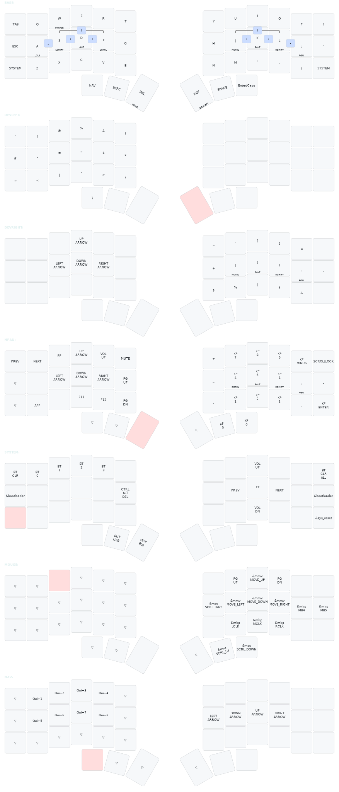

# ZMK Configuration

Personal ZMK firmware configuration with automated keymap alignment, visual generation, and build automation for Corne and Glove80 keyboards.

## Overview

This repository contains:

- **ZMK keymap configurations** for Corne 42-key and Glove80 80-key keyboards
- **Keymap alignment tool** (`align_keymap.py`) for consistent formatting based on physical layouts
- **Automated build system** (Makefile) for alignment, drawing generation, and firmware building
- **Comprehensive test suite** ensuring reliability across keymap modifications
- **Visual keymap generation** using keymap-drawer for documentation

## Keymap Visualizations




## Architecture

### Core Components

1. **align_keymap.py** - Python script that parses ZMK keymap files and aligns bindings according to JSON layout definitions
2. **Layout JSON files** - Define physical keyboard matrix (key positions vs. empty spaces)
3. **Makefile automation** - Orchestrates alignment, drawing generation, testing, and firmware building
4. **keymap-drawer integration** - Generates SVG visualizations from ZMK keymaps

### Supported Keyboards

- **Corne (42-key)** - 3x6 split with 3 thumb keys per side
- **Glove80 (80-key)** - Curved split with thumb cluster and function row

## Quick Start

### Basic Operations

```bash
# Align keymaps to proper formatting
make align

# Generate visual representations
make draw

# Run complete workflow (align + draw + build)
make sync

# Build firmware for flashing
make build

# Run test suite
make test
```

### Individual Keyboard Operations

```bash
# Complete workflow for specific keyboard
make sync-glove80
make sync-corne

# Align specific keyboard
make align-glove80
make align-corne

# Generate drawings for specific keyboard
make draw-glove80
make draw-corne

# Build firmware for specific keyboard
make build-glove80
make build-corne
```

## Makefile Targets

### Primary Workflows

- **`sync`** - Complete workflow: align → draw → build (includes timing)
- **`align`** - Align both keymaps using layout definitions
- **`draw`** - Generate SVG visualizations for both keyboards
- **`build`** - Build firmware for both keyboards
- **`test`** - Run comprehensive test suite
- **`clean`** - Remove generated files (UF2s, temporaries)

### Individual Operations

- **`sync-glove80`** / **`sync-corne`** - Complete workflow for specific keyboard (align → draw → build)
- **`align-glove80`** / **`align-corne`** - Align specific keymap
- **`draw-glove80`** / **`draw-corne`** - Generate SVG for specific keyboard  
- **`build-glove80`** / **`build-corne`** - Build firmware for specific keyboard
- **`test-verbose`** - Run tests with detailed output

## Keymap Alignment System

### Purpose

ZMK keymaps with complex behaviors (home row mods, layer-taps, etc.) become difficult to read without proper alignment. This tool automatically formats keymaps to align bindings in columns matching the physical keyboard layout.

### How It Works

1. **Parse keymap** - Extract layer definitions and bindings from ZMK keymap files
2. **Load layout** - Read JSON layout defining physical key positions
3. **Calculate widths** - Determine optimal column widths for alignment
4. **Format output** - Align bindings in columns matching physical layout

### Layout Definitions

JSON files define physical keyboard matrices:

```json
{
  "name": "Keyboard Layout",
  "layout": [
    ["X", "X", "X", "X"],  
    ["X", "X", "X", "X"],  
    ["-", "X", "X", "-"]   
  ]
}
```

- `"X"` = Key position
- `"-"` = Empty space (no key)

### Supported Binding Types

- **Simple keycodes**: `&kp A`, `&trans`, `&none`
- **Multi-parameter behaviors**: `&hml LCTRL A`, `&lt 1 SPACE`
- **Nested behaviors**: `&hmr &caps_word RALT`
- **Complex behaviors**: All ZMK behaviors (BT, RGB, media, mouse, etc.)

## Visual Generation

Uses [keymap-drawer](https://github.com/caksoylar/keymap-drawer) for SVG visualizations. Parse manually to preserve YAML formatting.

### Configuration

- **`keymap_drawer.config.yaml`** - Custom behavior mappings and styling
- **Column specification**: `-c 12` for both keyboards (6 columns per half × 2)

### Workflow

Parse and draw are decoupled for manual YAML control:

```bash
# 1. Parse .keymap → YAML (manual - after keymap changes)
keymap -c keymap_drawer.config.yaml parse -c 12 -z config/corne.keymap > corne_keymap.yaml

# 2. Draw YAML → SVG (automated - preserves YAML formatting)
make draw-corne   # or draw-glove80, or draw (both)
```

### Output Files

- `*_keymap.yaml` - Parsed keymap (edit manually for custom formatting)
- `*_keymap.svg` - Visual diagram (regenerate with `make draw-*`)

### Custom Behaviors

Configured in `keymap_drawer.config.yaml`:

- **Layer-taps**: `&ltl`, `&ltr`, `&ltlt`, `&ltrt` (finger/thumb)
- **Home row mods**: `&hml`, `&hmr`, `&hmlt`, `&hmrt` (mod+key)
- **Tap-dance**: `&bt_0-3`, `&caps_shift`, `&caps_return`

## Testing Framework

### Test Coverage

- **Layout loading** - JSON parsing and validation
- **Binding extraction** - Complex behavior parsing
- **Alignment formatting** - Column width calculation and output
- **Error handling** - File validation, binding count validation
- **Integration** - End-to-end workflow testing

### Test Structure

```text
tests/
├── test_align_keymap.py        # Main test suite
├── layouts/                    # Test layout definitions
├── simple_tests/              # Basic test cases
└── test_keymaps/
    ├── correct/               # Reference files (hand-aligned)
    ├── misaligned/           # Test input files
    └── test_output/          # Generated test outputs
```

### Key Test Cases

- **Validation**: Binding count verification with detailed error messages
- **Parsing**: Complex multi-parameter behavior extraction
- **Alignment**: Byte-for-byte comparison with reference files
- **Error Recovery**: Graceful handling of malformed inputs

### Running Tests

```bash
make test           # Full test suite
make test-verbose   # Detailed output
python3 -m pytest tests/test_align_keymap.py::TestClass::test_method -v
```

## Build System

### Firmware Building

Uses Docker-based ZMK build system:

- **Glove80**: Custom Nix-based build via MoErgo's ZMK fork
- **Corne**: Standard ZMK build with nice!nano v2 controller
- **Output**: UF2 files ready for flashing

### Build Dependencies

- **Docker** - Required for firmware compilation
- **keymap-drawer** - For SVG generation (`pip install keymap-drawer`)
- **Python 3.7+** - For alignment script
- **pytest** - For test execution

## Project Structure

```text
├── align_keymap.py             # Keymap alignment script
├── Makefile                    # Build automation
├── build.sh                    # Docker build wrapper
├── config/                     # ZMK configurations
│   ├── glove80.keymap         # Glove80 keymap
│   ├── corne.keymap           # Corne keymap
│   ├── *.conf                 # Board configurations
│   └── shared_behaviors.dtsi  # Common behaviors
├── tests/                      # Test suite
├── *_layout.json              # Keyboard layout definitions
├── *_keymap.yaml              # keymap-drawer intermediate files
├── *_keymap.svg               # Generated visualizations
└── *.uf2                      # Compiled firmware (gitignored)
```

## Development

### Adding New Keyboard Support

1. **Create layout JSON** defining physical key positions
2. **Add Makefile targets** for align/draw/build operations
3. **Create test cases** for the new layout
4. **Test workflow** with sample keymap

### Modifying Keymaps

1. **Edit keymap files** in `config/`
2. **Run alignment**: `make align`
3. **Validate changes**: `make test`
4. **Generate visuals**: `make draw`
5. **Build firmware**: `make build`

### Code Quality

- **Test coverage**: All functionality covered by pytest
- **Error handling**: Comprehensive validation and recovery
- **Documentation**: Technical comments and clear structure
- **Automation**: Minimal manual intervention required

## Dependencies

- **Python 3.7+** with standard library
- **Docker** for firmware building
- **keymap-drawer** for visualization generation
- **pytest** for test execution
- **ZMK-compatible keymap files**

## License

Part of personal ZMK configuration setup. Code provided as-is for reference.
